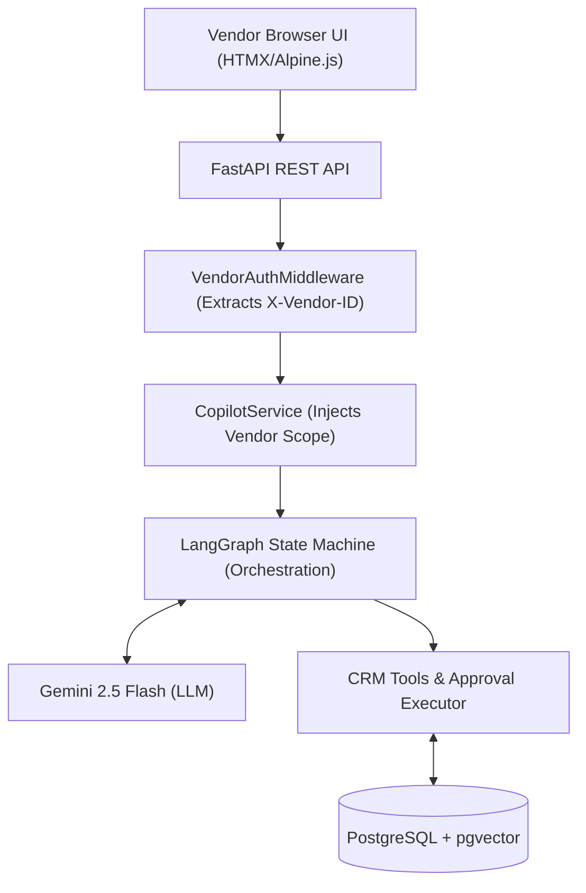

# HobbyFi Copilot: Technical Design & Implementation Report

**Author:** Dibyendu Mukherjee  
**Date:** July 2026  
**Scope:** AI Copilot for HobbyFi's AI-CRM Vendor Portal  

---

## 1. Executive Summary
The **HobbyFi Copilot** is a secure, tool-augmented AI assistant designed for the AI-CRM vendor portal. It handles two classes of work:
1. **Read-only Queries:** E.g., "What is today's revenue?" or "List trial users for Badminton."
2. **Write-intent Actions:** E.g., "Update user membership date." These are purely drafts and execute **only** upon explicit vendor approval (Human-In-The-Loop).

### Reference Documents
For full deployment instructions and audit logs, see our supplementary documents:
- [README: Setup & Architecture](https://docs.google.com/document/d/14dI0y45quBI65JKYwmn9sY3c0Iqm12cIq7Q__HmF5yM/edit?usp=sharing)
- [CHANGELOG: Implementation Audit](https://docs.google.com/document/d/1hi-KmDAnzcq2IAd2s1tfvRsVqDgUcVfndgl9n52y58g/edit?usp=sharing)
- [LEARNING_SEQUENCE: Development Progression](https://docs.google.com/document/d/1jY8ZFtGcf-FuNjkBaEyO8i80ymd0daRzMrvM7yjcOGM/edit?usp=sharing)

---

## 2. Architecture Overview
We decoupled the LLM from the database, treating the model as a reasoning engine that invokes strictly-typed API tools. The model has zero direct mutation privileges.

### Request Lifecycle

---

## 3. Technology Stack & Trade-offs
We chose a unified Python stack to maintain testability and seamless integration with ML libraries.

- **Orchestration:** **LangGraph** (Explicit cyclical state machine) & **FastAPI** (Type-safe backend).
- **Database:** **PostgreSQL 16** with **pgvector**.
- **LLM:** **Gemini 2.5 Flash** (Primary) with **Ollama** (Fallback).
- **Frontend:** **HTMX & Alpine.js** (Lightweight, assessment-friendly).

**Trade-offs Evaluated:**
- **Python vs. TypeScript (Mastra):** While TS is strong, AI tools (pgvector, LangGraph) are natively Pythonic. Using Python avoids a split microservice architecture.
- **pgvector vs. Dedicated Vector DB:** We kept vectors inside PostgreSQL via `pgvector` to reduce infrastructure overhead and keep deployment cost at $0, rather than relying on paid services like Pinecone.
- **Embeddings & Memory Constraints:** We initially used local `sentence-transformers` for embeddings. However, because free-tier hosting limits (like Render's 512MB RAM) cause Out of Memory (OOM) errors when loading PyTorch models, we shifted to the **Hugging Face Serverless Inference API**. This offloads the heavy memory burden while remaining 100% free and perfectly maintaining compatibility with our 384-dimensional `pgvector` schema.
- **Sliding Window vs. Summarization Memory:** Summarization requires extra LLM calls (latency/cost). A sliding window is deterministic and faster, albeit with shorter historical depth.

---

## 4. Memory Strategy
We implemented a **PostgreSQL-backed sliding window memory**. For every request, the backend loads the active conversation for the authenticated vendor and dynamically prunes the context to the **10 most recent exchanges**. This caps token limits and prevents hallucination, ensuring precise CRM interactions. Unstructured document memory is kept separate via `pgvector` embeddings to avoid workflow pollution.

---

## 5. Security & Guardrails
Safety is enforced through four distinct layers, ensuring prompts are not treated as permissions.

1. **Request-Level:** `VendorAuthMiddleware` validates the `X-Vendor-ID` header.
2. **Tool-Level (Tenant Isolation):** The backend actively overrides any LLM-supplied vendor scope with the cryptographically authenticated `vendor_id`. The LLM cannot query cross-vendor data.
3. **Approval-Level (HITL):** Write tools draft `audit_logs` (status: `pending`). The copilot executes nothing directly. The API verifies the authenticated vendor against the pending log before committing a transaction.
4. **Prompt-Level:** Strict instructions direct the LLM to remain concise and rely wholly on tool data.

---

## 6. Workflow Orchestration & Mock Schema
Our schema comprehensively covers the AI-CRM requirements: `vendors`, `users`, `games`, `memberships`, `orders`, `audit_logs`, `runtime_events`, and `conversations`.

**Read Workflow:**
Vendor query -> FastAPI Auth -> Copilot loads windowed memory -> LLM calls Read Tool -> Backend enforces `vendor_id` -> Response returned.

**Write Workflow:**
Vendor mutation intent -> LLM calls Write Tool -> Backend drafts pending `audit_logs` row -> UI displays Approval Card -> Vendor Approves -> Backend verifies identity and executes mutation.

---

## 7. Special Features Added
To push the project to a production standard, we developed features beyond the base requirements:

- **Graceful Fallback Mechanism:** Free LLMs hit rate limits. We built a 3-tier fail-safe: **Gemini (Primary) -> Local Model (Secondary) -> Deterministic Responder (Tertiary)**. If quotas deplete, the system degrades seamlessly rather than crashing, updating UI badges to alert the user.
- **Single-Flight Approvals:** The UI utilizes state locks to prevent duplicate approval mutations (double-clicking).
- **Runtime Auditing:** System fallback events and edge cases are actively logged in `runtime_events` for DevOps observability.

---

## 8. Learnings & Future Upgrades
The biggest developer learning was the friction between probabilistic models and deterministic business logic. Securing an LLM means assuming it will hallucinate; tenant isolation must exist fundamentally at the backend routing level, independent of the model's choices.

**Recommended Upgrades for Production:**
- **Bonus Feature (Future RAG Foundation):** We have successfully built and integrated a background document ingestion pipeline that chunks uploaded files and embeds them into `pgvector` (`POST /api/v1/documents/upload`). While this demo focuses purely on structured CRM interactions, this pipeline establishes the foundational workflow needed to expand the Copilot to answer unstructured support documentation queries in future iterations.
- **Auth:** Migrate `X-Vendor-ID` to JWT/OAuth logic.
- **Streaming:** Upgrade REST APIs to WebSockets for token-streaming.
- **RBAC:** Differentiate between Admin (auto-execute) and Staff (HITL required) roles.

**Reviewer Note:** To fully experience the robustness, we encourage testing the failure states: try asking for data belonging to another vendor (e.g. `v_67890_xyz`), or set your local `DEMO_LLM_CALL_BUDGET=0` to watch the elegant fallback mechanisms engage in real time.
